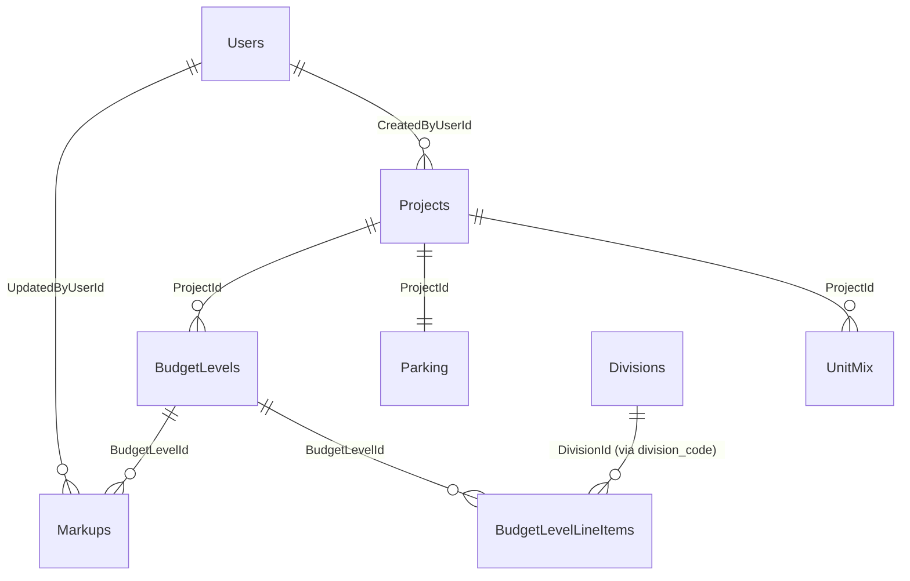

# Relationships & Load Order

How the seed JSON in `data/` maps into the canonical schema, the foreign-key
graph, the order to insert, and the Excel→schema transform rules applied.

Source data: `Excel-Docs-Projects/Budget - West Henderson - Level 3.xlsx`
Canonical schema: `docs/database/schema.md` (Schema A)

---

## Entity-relationship (seeded tables)

## Foreign keys

| Child table | Column (seed field) | Parent | Notes |
|---|---|---|---|
| Projects | `CreatedByUserId` | Users.Id | **NOT NULL** — needs a seed user first |
| UnitMix | `ProjectId` (`project_id`) | Projects.Id | cascade delete |
| Parking | `ProjectId` (`project_id`) | Projects.Id | one row per project |
| BudgetLevels | `ProjectId` (`project_id`) | Projects.Id | |
| BudgetLevelLineItems | `BudgetLevelId` (`budget_level_id`) | BudgetLevels.Id | |
| BudgetLevelLineItems | `CustomDivisionId` (`division_code`) | Divisions.Id | resolve code → Id at load |
| Markups | `BudgetLevelId` (`budget_level_id`) | BudgetLevels.Id | |
| Markups | `UpdatedByUserId` | Users.Id | **NOT NULL** — seed user |

---

## Load order (insert top → bottom)

1. **Users** — insert one system seed user. Not in the Excel; required by the
   NOT NULL FKs on Projects and Markups. Capture its `Id`.
2. **Projects** — `data/projects.json` (1 row). Set `CreatedByUserId` = seed user.
3. **Divisions** — `data/divisions.json` (master list, shared). Capture each
   `CsiCode → Id` mapping.
4. **UnitMix** — `data/unit_mix.json` (5 rows).
5. **Parking** — `data/parking.json` (1 row).
6. **BudgetLevels** — `data/budget_levels.json` (1 row: West Henderson L3.1).
   Capture its `Id`.
7. **BudgetLevelLineItems** — `data/budget_line_items.json` (258 rows). Map
   `budget_level_id` → BudgetLevels.Id and `division_code` → Divisions.Id.
8. **Markups** — `data/markups.json` (7 rows). Map `budget_level_id` and set
   `UpdatedByUserId` = seed user.

---

## ID strategy

The seed JSON uses **stable slug keys**, not GUIDs:

- `project_id`: `"west-henderson"`
- `budget_level_id`: `"west-henderson-l3"`
- `line_item_id`: `"whl3-0001"` … `"whl3-0258"`
- divisions key by `code` (`"03"`, `"FFE"`, `"BR"`, …)

At load time the importer generates real `UNIQUEIDENTIFIER`s (or lets the DB
default `NEWID()`) and keeps a slug→GUID map to wire up the FKs. This keeps the
JSON diffable and human-readable while the database stays GUID-native.

---

## Excel → schema transform rules (already applied in `data/`)

These are the non-obvious decisions baked into the extraction. They are the
things most likely to be "wrong" if someone re-extracts naively.

### Markups — the Excel groups differently than the schema
The Excel collapses some markups onto shared division codes. The seed **splits
them back** into the canonical 7-kind model:

| Excel row | Excel code | → Canonical kind | Canonical code |
|---|---|---|---|
| Overhead | 56 | `overhead` | **99** |
| Contractor Fee | 56 | `fee` | **98** |
| Sub Bonds | 50 | `bonds` | **50** |
| GL Insurance | 50-0001 | `insurance` | **51** |
| General Requirements | 01 | `general_requirements` | 01 |
| Bid Risk | (BABA block) | `bid_risk` | **BR** |
| Construction Contingency | 55-9800 | `contingency` | 55 |

### Real markup rates (override the dummy JSON values)
- General Requirements **6%**
- Bid Risk **1%** ← dummy JSON wrongly had 2%
- Construction Contingency **5%** ← dummy JSON wrongly had 6%
- Sub Bonds ~**1.0518%** (rate on applicable hard costs)
- GL Insurance **fixed $648,527.58** (mode = `fixed`; computed on the
  `Insurance_Bonds` sheet: 3.7395/$1,000 base + umbrella, allocated by % built
  per construction year + 10% annual inflation). Store as fixed, not a rate.
- Overhead **2%**
- Contractor Fee **6%**

### Markup base exclusions (unchanged from schema)
Divisions excluded from every markup base: `01, 50, 51, 55, 98, 99, BR`.
Markup base = Hard Cost + General Requirements.

### Project header
- `floors` = `"2 & 3 Levels"` is **free text**, not the `Floors SMALLINT`
  column → mapped to a new `FloorsLabel NVARCHAR` (see `schema/seed-tables.sql`).
- `Status` is not in the Excel → defaulted to `Active`.
- "Bldg. SF" (422,635) → `LivableSF`. This sheet's per-GSF figure also divides
  by 422,635, so `GrossSF` ≈ `LivableSF` here; confirm GSF source before relying
  on it for efficiency calcs.

### Line-item anomalies preserved verbatim (do NOT silently "fix")
- Trailing-letter cost codes kept as-is: `06-2001S`, `28-4601S`, `09-6520A`.
- One line has a **blank cost code** ("Start Up Utilities", $50,000) — captured
  under its running division (33) with `cost_code = null`.
- Summary-only pseudo-divisions `03-G` (Parking Garage) and `13-G` (Trash Chute)
  show `#N/A` in the workbook and are **excluded** — they are not real line items.
- Earthwork/grading uses CSI **Division 31** (canonical), consistent with schema.

---

## What is NOT in this package (needs a separate source)

This workbook is the **budget**, not the bid leveling. The following schema
areas have no faithful source here and must come from the bid-leveling
sheets/files (or the prototype's `DATA`) before those features work:

- **Bidders / Proposals / ProposalLineItems / TradePackages** — the workbook's
  `Source` column has hints ("Bruner", "Proposal", company names like "Contempo
  Proposal", "Arzano") but no structured multi-bidder leveling, and **no
  `TradePackages.GroupKeys` mapping** (the join glue between trades and line
  items). This is the single biggest gap for the bid-picker feature.
- **ComparableProjects / ComparableProjectCosts** — benchmark sources (Bruner,
  Torrey Pines, Pebble, Decatur, Flamingo…) are referenced as cost sources but
  their per-division cost tables are not in this file.
- **Takeoffs, BudgetApprovals, AuditLog, Notifications, Roles, ProjectUsers** —
  operational/empty at seed time.
- **Robindale 215 (L2)** — second seed project; not in this workbook.
