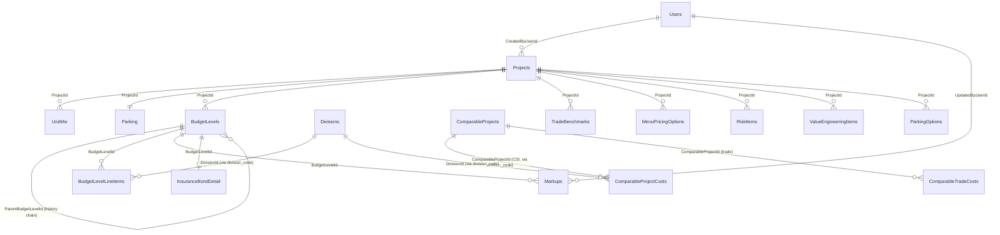

# Relationships & Load Order

How the seed JSON in `data/` maps into the canonical schema, the foreign-key
graph, the order to insert, and the Excel→schema transform rules applied.

Source data: `Excel-Docs-Projects/Budget - West Henderson - Level 3.xlsx`
Canonical schema: `docs/database/schema.md` (Schema A)

---

## Entity-relationship (seeded tables)

> **Budget level history.** This seed now contains **all five** West Henderson budget
> versions, chained via `ParentBudgetLevelId`:
> L1.1 → L1.2 (Update A) → L1.3 (Update B) → L2.1 (Transmitted) → L3.1. Each is a full
> ~250-line budget that reconciles to its own Excel "Total Hard Costs" to the cent.
> Use the chain for `BaselineAmount` variance and the change-log views.

## Foreign keys

| Child table | Column (seed field) | Parent | Notes |
|---|---|---|---|
| Projects | `CreatedByUserId` | Users.Id | **NOT NULL** — needs a seed user first |
| UnitMix | `ProjectId` (`project_id`) | Projects.Id | cascade delete |
| Parking | `ProjectId` (`project_id`) | Projects.Id | one row per project |
| BudgetLevels | `ProjectId` (`project_id`) | Projects.Id | |
| BudgetLevelLineItems | `BudgetLevelId` (`budget_level_id`) | BudgetLevels.Id | |
| BudgetLevelLineItems | `CustomDivisionId` (`division_code`) | Divisions.Id | resolve code → Id at load |
| Markups | `BudgetLevelId` (`budget_level_id`) | BudgetLevels.Id | |
| Markups | `UpdatedByUserId` | Users.Id | **NOT NULL** — seed user |
| BudgetLevels | `ParentBudgetLevelId` (`parent_budget_level_id`) | BudgetLevels.Id | self-ref history chain; NULL for L1.1 |
| ComparableProjectCosts | `ComparableProjectId` (`comparable_project`) | ComparableProjects.Id | resolve name → Id at load |
| ComparableProjectCosts | `DivisionId` (`division_code`) | Divisions.Id | resolve code → Id |
| ComparableTradeCosts | `ComparableProjectId` (`comparable_project`) | ComparableProjects.Id | |
| TradeBenchmarks | `ProjectId` | Projects.Id | |
| MenuPricingOptions | `ProjectId` | Projects.Id | |
| InsuranceBondDetail | `BudgetLevelId` | BudgetLevels.Id | one row per level (L3 seeded) |
| RiskItems | `ProjectId` | Projects.Id | `HasRefError` flags `#REF!` cells |
| ValueEngineeringItems | `ProjectId` | Projects.Id | |
| ParkingOptions | `ProjectId` | Projects.Id | `ScopeJson` = scope line array |

---

## Load order (insert top → bottom)

1. **Users** — insert one system seed user. Not in the Excel; required by the
   NOT NULL FKs on Projects and Markups. Capture its `Id`.
2. **Projects** — `data/projects.json` (1 row). Set `CreatedByUserId` = seed user.
3. **Divisions** — `data/divisions.json` (master list, shared). Capture each
   `CsiCode → Id` mapping.
4. **UnitMix** — `data/unit_mix.json` (5 rows).
5. **Parking** — `data/parking.json` (1 row).
6. **BudgetLevels** — `data/budget_levels.json` (**5 rows**: L1.1, L1.2, L1.3,
   L2.1, L3.1). Insert in order; resolve `parent_budget_level_id` to the parent's
   `Id` as you go (L1.1 has none). Capture each slug→`Id`.
7. **BudgetLevelLineItems** — `data/budget_line_items.json` (**1,337 rows across
   all 5 levels**). Map `budget_level_id` → BudgetLevels.Id and `division_code`
   → Divisions.Id. (Line-item IDs are prefixed per level, e.g. `west-henderson-l2-1-0042`.)
8. **Markups** — `data/markups.json` (**35 rows** = 7 kinds × 5 levels). Map
   `budget_level_id` and set `UpdatedByUserId` = seed user.
9. **ComparableProjects** — `data/comparable_projects.json` (6 rows). Capture
   each `name → Id`.
10. **ComparableProjectCosts** — `data/comparable_project_costs.json` (CSI-keyed;
    resolve `comparable_project`→Id and `division_code`→Divisions.Id).
11. **ComparableTradeCosts** — `data/comparable_trade_costs.json` (trade-level).
12. **TradeBenchmarks** — `data/trade_benchmarks.json`.
13. **InsuranceBondDetail** — `data/insurance_bonds.json` (1 row, L3).
14. **MenuPricingOptions** — `data/menu_pricing.json`.
15. **RiskItems** — `data/risk_items.json` (keep `has_ref_error` rows).
16. **ValueEngineeringItems** — `data/value_engineering.json`.
17. **ParkingOptions** — `data/parking_options.json` (serialize `scope` → `ScopeJson`).

---

## ID strategy

The seed JSON uses **stable slug keys**, not GUIDs:

- `project_id`: `"west-henderson"`
- `budget_level_id`: `"west-henderson-l3"`
- `line_item_id`: `"whl3-0001"` … `"whl3-0258"`
- divisions key by `code` (`"03"`, `"FFE"`, `"BR"`, …)

At load time the importer generates real `UNIQUEIDENTIFIER`s (or lets the DB
default `NEWID()`) and keeps a slug→GUID map to wire up the FKs. This keeps the
JSON diffable and human-readable while the database stays GUID-native.

---

## Excel → schema transform rules (already applied in `data/`)

These are the non-obvious decisions baked into the extraction. They are the
things most likely to be "wrong" if someone re-extracts naively.

### Markups — the Excel groups differently than the schema
The Excel collapses some markups onto shared division codes. The seed **splits
them back** into the canonical 7-kind model:

| Excel row | Excel code | → Canonical kind | Canonical code |
|---|---|---|---|
| Overhead | 56 | `overhead` | **99** |
| Contractor Fee | 56 | `fee` | **98** |
| Sub Bonds | 50 | `bonds` | **50** |
| GL Insurance | 50-0001 | `insurance` | **51** |
| General Requirements | 01 | `general_requirements` | 01 |
| Bid Risk | (BABA block) | `bid_risk` | **BR** |
| Construction Contingency | 55-9800 | `contingency` | 55 |

### Real markup rates (override the dummy JSON values)
- General Requirements **6%**
- Bid Risk **1%** ← dummy JSON wrongly had 2%
- Construction Contingency **5%** ← dummy JSON wrongly had 6%
- Sub Bonds ~**1.0518%** (rate on applicable hard costs)
- GL Insurance **fixed $648,527.58** (mode = `fixed`; computed on the
  `Insurance_Bonds` sheet: 3.7395/$1,000 base + umbrella, allocated by % built
  per construction year + 10% annual inflation). Store as fixed, not a rate.
- Overhead **2%**
- Contractor Fee **6%**

### Markup base exclusions (unchanged from schema)
Divisions excluded from every markup base: `01, 50, 51, 55, 98, 99, BR`.
Markup base = Hard Cost + General Requirements.

### Multi-sheet / prior-level extraction (extract_full.py)
The four prior budget versions share the Level 3 body layout (header row 19, line
items from row 20; per-line amount in col 10, division subtotal col 11) but the
markup/FFE/total rows sit at **different row numbers per sheet**. The extractor is
therefore **marker-driven** — it locates each block by its column-A label, not by
hardcoded rows. Specific decisions:

- **General Requirements** amount is in **col 10** on L3 but **col 11** on the prior
  levels — read col 10, fall back to col 11.
- **FFE** is a *positional* group: every dashed-code row (normal CSI codes like
  `11-6613`, `12-5000`) between the Bid-Risk markup and the Contingency markup. The
  `FFE Extra` label is the top of the block on L1-style sheets but a bottom subtotal
  on L3, so it is bounded by the two surrounding markers, not the label.
- **Prior-level markups are stored as fixed snapshots** (`mode = 'fixed'`,
  `fixed_amount = amount`, `rate = null`): they capture the historical dollar amount,
  not a live rate. Only **L3** carries the proven canonical rates (GR 6%, Bid Risk 1%,
  Contingency 5%, Overhead 2%, Fee 6%, GL Insurance fixed). The old "56 = Overhead +
  Fee" combined row is split via its two sub-rows on every level.
- **Validation:** for each level, Σ line items + Σ markups = that sheet's
  `Total Hard Costs` (cell K/L 14) to within ±$0.02 (cent rounding).

### Comparable-project costs (Normalize + Offsite Comp)
- `comparable_project_costs.json` is **CSI-division-keyed** (from `Normalize`): West
  Henderson + Bruner / Torrey Pines / Decatur-Rome. Maps to `ComparableProjectCosts`.
- `comparable_trade_costs.json` is **trade-keyed** (from `Offsite Comp`, adds Pebble /
  Russell IV). Trades don't map 1:1 to CSI divisions, so they go to the separate
  `ComparableTradeCosts` table — do **not** force them into `ComparableProjectCosts`.

### Project header
- `floors` = `"2 & 3 Levels"` is **free text**, not the `Floors SMALLINT`
  column → mapped to a new `FloorsLabel NVARCHAR` (see `schema/seed-tables.sql`).
- `Status` is not in the Excel → defaulted to `Active`.
- "Bldg. SF" (422,635) → `LivableSF`. This sheet's per-GSF figure also divides
  by 422,635, so `GrossSF` ≈ `LivableSF` here; confirm GSF source before relying
  on it for efficiency calcs.

### Line-item anomalies preserved verbatim (do NOT silently "fix")
- Trailing-letter cost codes kept as-is: `06-2001S`, `28-4601S`, `09-6520A`.
- One line has a **blank cost code** ("Start Up Utilities", $50,000) — captured
  under its running division (33) with `cost_code = null`.
- Summary-only pseudo-divisions `03-G` (Parking Garage) and `13-G` (Trash Chute)
  show `#N/A` in the workbook and are **excluded** — they are not real line items.
- Earthwork/grading uses CSI **Division 31** (canonical), consistent with schema.

---

## What is NOT in this package (needs a separate source)

This workbook is the **budget**, not the bid leveling. The following schema
areas have no faithful source here and must come from the bid-leveling
sheets/files (or the prototype's `DATA`) before those features work:

- **Bidders / Proposals / ProposalLineItems / TradePackages** — the workbook's
  `Source` column has hints ("Bruner", "Proposal", company names like "Contempo
  Proposal", "Arzano") but no structured multi-bidder leveling, and **no
  `TradePackages.GroupKeys` mapping** (the join glue between trades and line
  items). This is the single biggest gap for the bid-picker feature.
- **Takeoffs, BudgetApprovals, AuditLog, Notifications, Roles, ProjectUsers** —
  operational/empty at seed time.
- **Robindale 215 (L2)** — second seed project; not in this workbook.

> ✅ **Closed gap (was listed here):** *ComparableProjects / ComparableProjectCosts.*
> Earlier this package said the per-division benchmark costs were "not in this file."
> They **are** — on the `Normalize` (CSI-keyed, vs Bruner / Torrey Pines / Decatur) and
> `Offsite Comp` (trade-level, adds Pebble / Russell IV) sheets — and are now extracted
> to `data/comparable_project_costs.json` + `data/comparable_trade_costs.json`. Comp
> projects lack a `TotalGsf`/units in some sheets; fill from `Comparison to Other`
> (Bruner units = 194) if needed before computing $/GSF.
